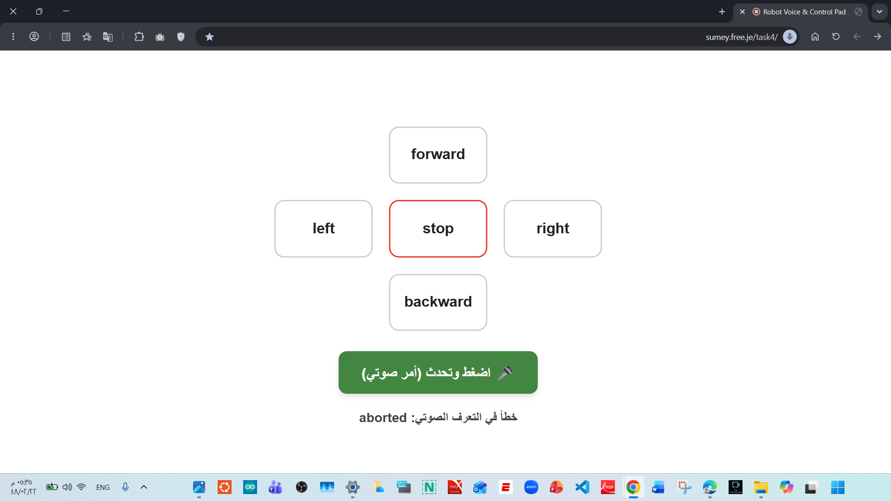
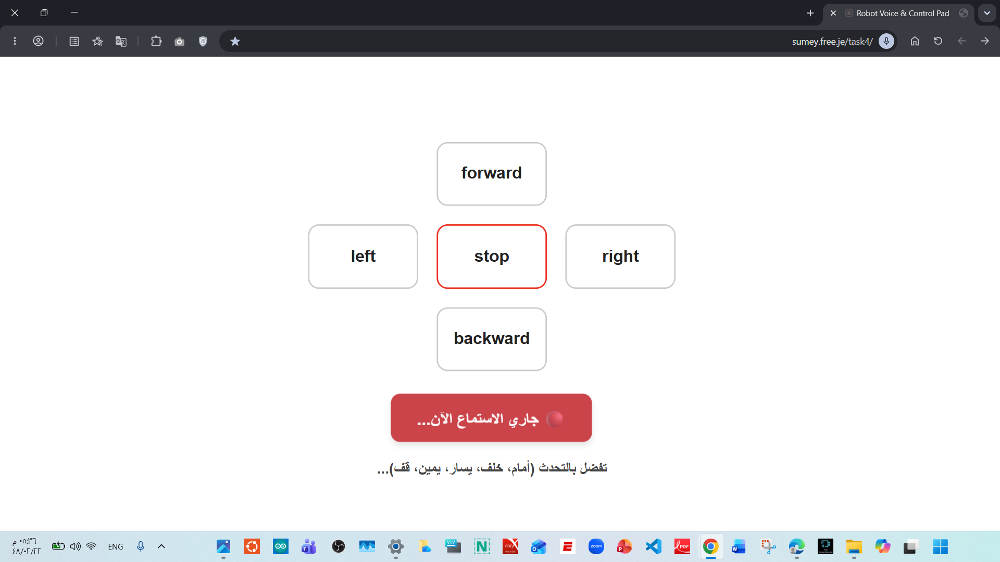

# 🤖control-web-page-by-Voice-to-text

A smart web-based robot control panel that supports both **traditional buttons** and **Arabic/English voice commands**, directly linked to an **InfinityFree** database to store and update movement states in real-time (`f`, `b`, `l`, `r`, `S`).

---
## 📸 Interface Screenshots

Here is a preview of the web control panel interface during different states:

| Idle / Error State | Active Listening State |
| :---: | :---: |
|  |  |
| *Initial button layout with status message* | *Active voice recognition listening mode* |
---
## 📽️ Project Video:
You can watch the live demonstration of the web control panel and Arabic voice recognition below:

  <video width="100%" controls>
    <source src="web_4.mp4" type="video/mp4">
    Your browser does not support the video tag.
  </video>

> **Note:** If the video does not play directly, you can also view or download it directly from the repository using this direct link: [Download/View web_4.mp4](web_4.mp4)

---
##📁 Project Structure (5 Essential Files)
These five core files should be uploaded together inside the htdocs directory on your hosting server:

📄 db.php: Database connection script.

🛠️ setup.sql: SQL script to create the robot_state table (executed once in phpMyAdmin).

🔄 update_command.php: Receives commands (from buttons or voice), maps them, and updates the database.

📡 get_state.php: Fetches the current robot state from the database.

---
##🎙️ Voice Control Feature (Speech-to-Text)
The system utilizes the browser's native Web Speech API.

Clicking the "🎤 Click & Speak (Voice Command)" button and granting microphone access allows you to speak commands like:

"أمام" or "forward" ➔ mapped to character f (Forward)

"خلف" or "backward" ➔ mapped to character b (Backward)

"يسار" or "left" ➔ mapped to character l (Left)

"يمين" or "right" ➔ mapped to character r (Right)

"قف", "توقف", or "stop" ➔ mapped to character S (Stop)

🌐 index.html: Interactive user interface featuring control buttons and voice recognition.

